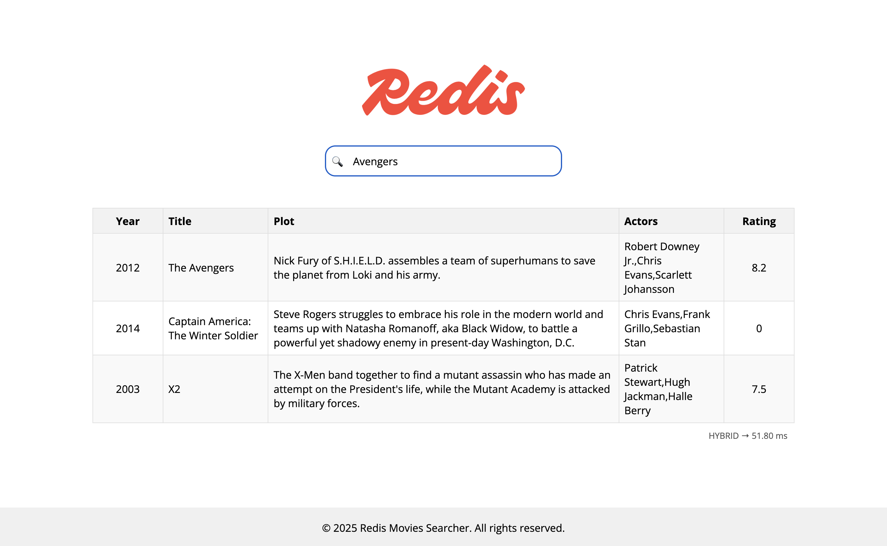

# Redis Movies Searcher

Searching for movies can be challenging. If you know the exact title of the movie you're looking for, chances are you'll find it easily. But what if you don't?

Often, we only have a faint recollection of what a movie is about, not a concrete description of its plot. This vague memory is how most of us naturally remember films, and it should be sufficient for finding what we're looking for.
 That's exactly what the Redis Movies Searcher does. It allows you to search for movies based on your imperfect memories and partial descriptions, making the process of finding that film you've been thinking about simpler and more intuitive.



This application allows you to search for movies using a combination of popular search techniques, such as FTS (Full-Text Search) and VSS (Vector Similarity Search). These capabilities are implemented using the [Redis Query Engine](https://redis.io/docs/latest/develop/interact/search-and-query/).

## Deploying locally

To deploy this application locally, you will need to have the following prerequisites:

* **[Docker](https://www.docker.com)**: to pull images and create the containers with the services.

### Steps

#### 1. Executing the services

Go to the root directory from this project where the file `docker-compose.yml` is located and execute the following command:

```bash
docker compose up -d
```

Once the services finish starting up, you can access the game in the following URL:

http://localhost:8080/redis-movies-searcher

To stop the services, execute the following command:

```bash
docker compose down
```

## Searching movies

You can search for movies using the following approaches:

* **Full-Text Search (FTS)**: This method allows you to search for movies using keywords or phrases that match either the title or actors from the movie. If you type `Apes`, you should see only movies that contain this keyword in the title. Such as `Planet of the Apes`. If you type `Tom Hanks`, you should see movies that have Tom Hanks in the cast. Such as `The Terminal` or `Philadelphia`.
* **Vector Similarity Search (VSS)**: This method allows you to search for movies based on their similarity to a given vector. It is useful when you have a vague idea of what you're looking for, but not a specific title or keywords. If you type `Dude who teaches rock` you should see the movie `The School of Rock`.

Note that you don't get to choose whether you're using FTS or VSS. The application will automatically choose the best approach based on the query you typed. It will start searching using FTS, and if there aren't enough results, it will complement the search with VSS.

## License

Redis Movies Searcher is licensed under the **[MIT license](LICENSE)**.
